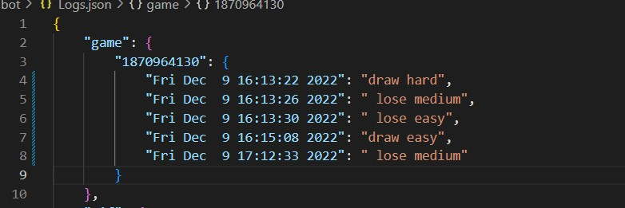

---
# Game bot

Игровой бот реализован с помощью библиотек `telebot` и `PyTelegramBotApi`. Бот не поддерживает одновременное пользование несколькими устройствами.  Как он устроен:

У игрового бота есть три уровня сложности:

1. `Легкий` - бот ставит "фишку" наугад, обязательно проверяя на займет ли он занятое место

2. `Средний`  - бот проверяет сможет ли он напасть или защититься, если не может - ставит фишку рандомно, если может - нападает/защищается 
    
    ```Нападение - если у бота есть две фишки в ряд, то он поставит фишку, дополнив ряд для победы```
    
    ```Защита -  если у игрока есть две фишки в ряд, то бот поставит фишку на оставшуюся позицию в этом ряду, прервав "выигрышный" ряд игрока```

3. `Сложный` - первые три "шага" игры прописаны у бота условиями, дальше он переходит в режим нападения/защиты или рандома.

Ключевыми в ходе игры являются следующие переменные:

* `turn` - номер "хода" в игре

* `gb_list` - игровое поле, представляет собой список, длиной в 9 элементов, хранящий цифры от 1 до 9, либо `крестик` или `нолик`

* `player` - хранит фишку игрока(`X`/`O`)

* `boter` - по аналогии с `player` хранит фишку бота

* `dif_lvl` - уровень сложности `1-3`

* `gb_dict` - глобальный словарь для красивого "прердставления" игрового поля

* `user_dict` - словарь, хранящий в себе еще один словарь с основными переменными для каждого пользователя, ключом ко вложенному словарю является `id` пользователя

Само поле реализовано саморедактирующимися `Callback`-кнопками в одном сообщениии. При нажатии на поле происходит проверка:

    При нажатии на кнопку вернется текст этой кнопки, соответственно на стадии проверки сообщения выполняются действия, если Callback.data - любая цифра от 1 до 9, если это не так (крестик или нолик) - бот сделает предупреждение.

Если проверка была пройдена - выбранная кнопка меняется на фишку игрока и почти сразу за этим последует ход бота

После каждого хода в игре (будь то игрок или бот) происходит проверка на выигрыш по простому принципу: программа просматривает все строки, столбцы и диагонали и в случае нахождения "победной" "строки" проверка прервется и игра оповестит о победе или поражении. Если же было сделано 9 ходов, а игра не завершена - бот оповестит и ничьей.

Каждую победу/ничью/поражение происходит запись в файл `Logs.json` Запись имеет следующий вид: `{game: {user_id: {timenow : win/lose/draw}}}`

Примеры работы программы



---
# Gif bot

Бот реализован с помощью библиотек `telebot`,  `PyTelegramBotApi`,  `requests`. Как он устроен:

Бот берет данные с сайта [giphy.com](`http://giphy.com`) c помощью `get` запроса библиотеки `requests`.

В боте реализовано три разны команды:

1. `Гиф по тегу` - бот попросит пользователя ввести тег - предмет поиска - после чего пришлет пользователю наиболее релевантную `gif`-картинку по этому тегу.

2. `Рандомная гиф` - бот пришлет пользователю случайную `gif`-картинку

3. `Рандомная гиф по тегу` - бот попросит пользотеля ввести тег - предмет поиска - после чего пришлет пользователю рандомную `gif`-картинку по этому тегу.

Так же доступна подсказка по кнопку, которая выведет список команд и действий бота.

Все команды вшиты в простые `Inline`-кнопки

После каждого действия пользователя файл `Logs.json` обновляется следующими данными: `{gif : {user_id : {time_from_era_start : action}}}`

Примеры работы программы:


